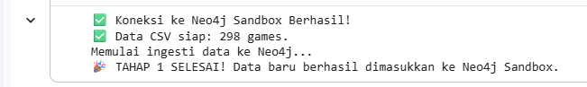
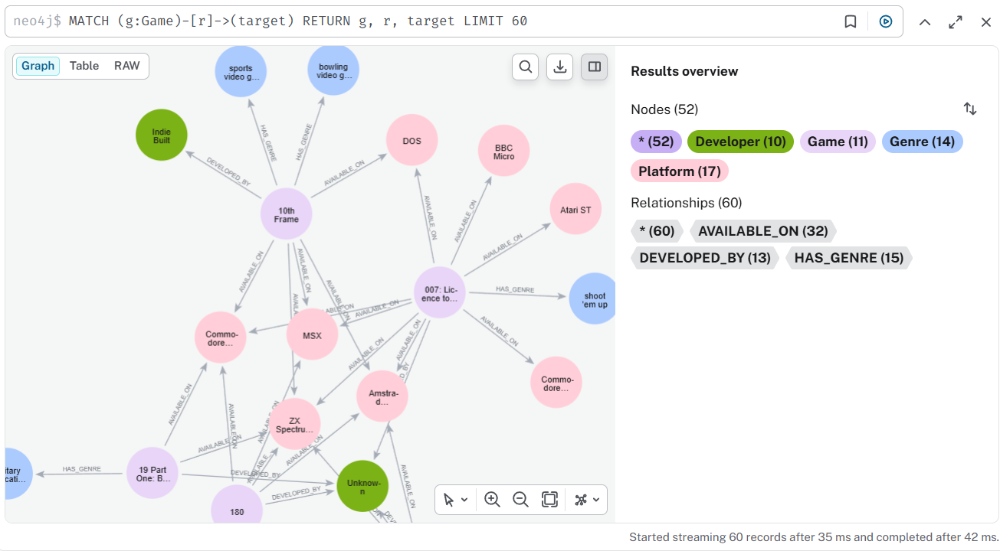
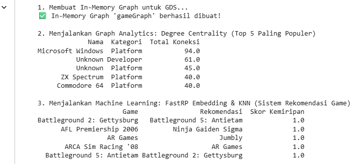

# 🎮 Knowledge Graph Final Project: Game Dataset Analysis & LLM Integration

Repositori ini berisi dokumentasi, dataset, dan kode sumber untuk Final Project Mata Kuliah Graf Pengetahuan. Proyek ini mendemonstrasikan implementasi *Knowledge Graph* menggunakan Neo4j, Graph Data Science (GDS), dan integrasi LLM (Google Gemini) untuk interaksi *Text-to-Cypher* serta *Graph Builder*.

## 🧑‍🎓 Identitas
* **Nama:** MUHAMMAD FAIZA FACHRA AZIZI
* **NIM:** [Masukkan NIM Anda]
* **Target Tier:** Tier 4 (Nilai 90-100)
* **Link Video Demo:** [Masukkan Link Video YouTube Anda]

---

## 🏗️ Arsitektur & Teknologi
* **Database:** Neo4j Sandbox (Versi 5.x) + GDS Plugin
* **Bahasa Pemrograman:** Python (Google Colab / Jupyter) + Cypher
* **Library Utama:** `neo4j`, `pandas`, `langchain`, `langchain-google-genai`, `langchain-community`
* **LLM:** Google Gemini (`gemini-2.5-flash`) via API

---

## 📊 Eksekusi & Hasil (Tahapan Tier 1 - 4)

Proyek ini dibagi menjadi 4 tahap eksekusi utama, yang seluruhnya telah berjalan dengan sukses:

### Tahap 1: Ingesti Data (CSV ke Graph)
Dataset `integrated_game_data.csv` dibaca menggunakan Pandas, dibersihkan, dan diunggah ke Neo4j menggunakan *query* Cypher (`UNWIND`, `MERGE`).
* **Hasil:** 298 baris data game berhasil dimasukkan.
* **Skema Entitas:** `Game`, `Developer`, `Genre`, dan `Platform`.

### Tahap 2: Graph Analytics & Machine Learning (GDS) - *Syarat Tier 1 & 2*
* **Degree Centrality:** Menemukan entitas paling populer/dominan dalam graf. Berdasarkan analisis, `Microsoft Windows` (Platform) adalah node paling terhubung dengan total 94 koneksi, disusul oleh `ZX Spectrum` dan `Commodore 64`.
* **Machine Learning (FastRP & KNN):** Membuat *embedding* dari struktur graf untuk sistem rekomendasi game. Contoh hasil: Sistem berhasil merekomendasikan `Battleground 5: Antietam` untuk pemain game `Battleground 2: Gettysburg` dengan skor kemiripan 1.0.

### Tahap 3: LLM Text-to-Cypher (RAG) - *Syarat Tier 3*
Membangun *pipeline* `GraphCypherQAChain` yang menghubungkan AI Gemini langsung dengan skema database Neo4j. AI berhasil merespons pertanyaan bahasa natural ke dalam bahasa Cypher secara otomatis.
* **Q:** *"Ada berapa banyak judul game di dalam database ini?"*
  **A:** AI men-generate `MATCH (g:Game) RETURN count(g)` dan menjawab dengan tepat: **298 judul game**.
* **Q:** *"Sebutkan 3 judul game yang memiliki genre action game!"*
  **A:** AI men-generate *query* yang tepat dan menjawab: **.kkrieger, 720°, dan A View to a Kill**.

### Tahap 4: LLM for Graph Builder (Unstructured Data) - *Syarat Tier 4*
Mendemonstrasikan kemampuan LLM membaca teks berita yang tidak terstruktur, melakukan *Named Entity Recognition* (NER), dan mengekstraknya langsung menjadi format graf ke Neo4j menggunakan `LLMGraphTransformer`.
* **Input Teks:** Artikel singkat tentang game "Genshin Impact".
* **Hasil Eksekusi:** AI secara mandiri menemukan node `Genshin Impact (Game)`, `Action Role-Playing Game (Genre)`, `Mihoyo (Developer)`, serta platformnya, lalu membentuk relasi `IS_A`, `DEVELOPED_BY`, dan `AVAILABLE_ON` secara otomatis.

---

## 🚀 Cara Menjalankan Kode (How to Run)

1. **Siapkan Database:** Buka [Neo4j Sandbox](https://sandbox.neo4j.com/), buat *Blank Sandbox*, lalu salin IP (Bolt URL) dan Passwordnya.
2. **Siapkan API Key:** Dapatkan kredensial *API Key* melalui Google AI Studio.
3. **Eksekusi di Colab:** * Buka file `.ipynb` yang terlampir di repositori ini melalui Google Colab.
   * Unggah file dataset CSV ke *environment* Colab.
   * Ubah variabel `URI`, `PASSWORD`, dan `GOOGLE_API_KEY` sesuai kredensial Anda.
   * Jalankan sel kode secara berurutan (Tahap 1 hingga Tahap 4).

---

## 🤖 Deklarasi Penggunaan AI
Penyusunan kode dalam proyek ini dibantu oleh *Google Gemini* melalui antarmuka chat untuk merancang struktur *Graph Ingestion* (Cypher), *debugging* isu kompatibilitas pada *library* LangChain (seperti penanganan modul *community* dan deteksi model AI otomatis), serta penulisan draf awal dokumentasi `README.md` ini.

## 📸 Lampiran Bukti Eksekusi (Screenshots)

### A. Koneksi Database & Ingesti Data

### B. Visualisasi Knowledge Graph

### C. Graph Analytics & Machine Learning

